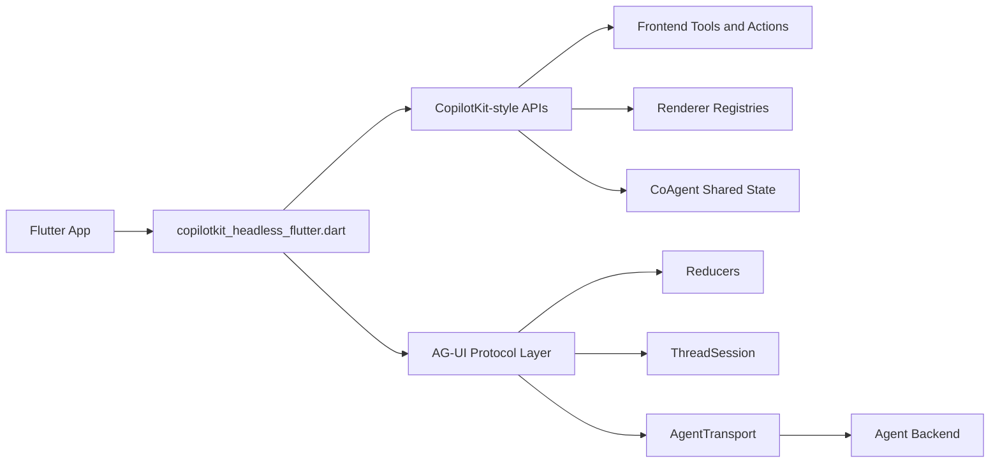

# Architecture

`copilotkit_headless_flutter` provides a Flutter-friendly headless layer over
AG-UI. The package keeps the wire protocol portable and exposes CopilotKit-style
concepts for actions, tools, generative UI, shared state, and chat sessions.



## Package Boundary

The package owns portable behavior:

- AG-UI protocol models and event envelopes.
- Reducers and immutable thread-session models.
- Generic transport interfaces and HTTP/SSE transport.
- Copilot action registry and tool runloop.
- Renderer registries for action UI and state UI.
- CoAgent shared-state helpers.

The consuming app owns product-specific behavior:

- Authentication and token refresh.
- App database persistence.
- State-management adapters.
- Platform tools such as clipboard, sharing, maps, files, and permissions.
- Product UI shells and debug overlays.

## Import Rule

Consumers should import only:

```dart
import 'package:copilotkit_headless_flutter/copilotkit_headless_flutter.dart';
```

Do not import from `package:copilotkit_headless_flutter/src/...`; those files
are implementation detail and may change without a breaking-version guarantee.
